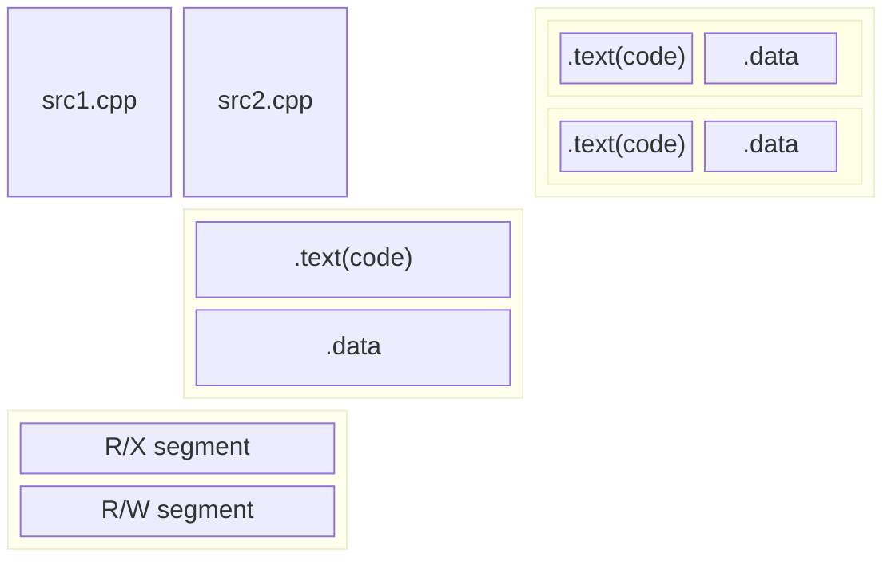

> [!CAUTION]
>
> [Linkers, Loaders and Shared Libraries in Windows, Linux, and C++ - Ofek Shilon - CppCon 2023](https://www.youtube.com/watch?v=_enXuIxuNV4)

# 术语

- shared library 动态库

  指代 shared objects, dynamic object, dynamic shared object(DSO), dynamic load library(dll), dynamic shared library.

- binary 二进制

  executable / shared library

- symbol 符号

  函数 / 全局变量，

- Linux:

  unix-like system（包括 mac-os）

# 简介 link

