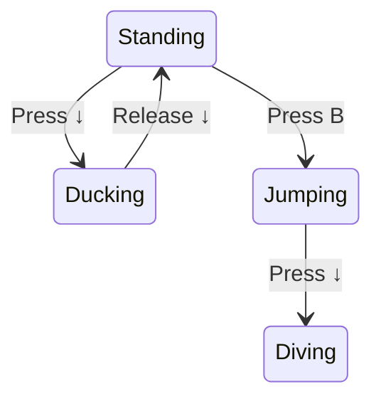

> [!CAUTION]
>
> 本文是文章 [State · Design Patterns Revisited · Game Programming Patterns](https://gameprogrammingpatterns.com/state.html) 的阅读翻译。
>
> 顺便文章里的代码都是 C++ 写的，这里我可能会使用 Rust 来实现，因为我现在没有 C++ 环境。

# 前言

文章说了太多东西了，表面上它只是 GoF 的 State pattern，但是如果不讲有限状态机的话就没法深入到游戏领域。但这样又会引入 *hierachical state machines* 和 *pushdown automata*.

内容太多了，所以为了保证内容简介，示例代码的细节你需要自己补充。

如果你从来没听说过状态机的话也别担心，这些对于 AI 和编译器领域的大神来说很常见，对于其他领域的程序员来说不常见。

# 开始

假设我们正在做一个 2d platform 游戏，我们需要实现玩家控制角色的一些行为，假设按 B 角色就会跳。如下：

```rust
pub fn handle_input(&mut self, input: Input) {
    if input.is_press_b() {
        self.vel_y = JUMP_VELOCITY;
        self.set_graphics();
    }
}
```

发现问题了吗？

没有一个机制来阻止角色“在空中再进行跳跃”，只要一直按 B 角色就能一直起跳。最简单的修复方式是增加一个 `is_jumping` 判断：

```rust
pub fn handle_input(&mut self, input: Input) {
    if input.is_press_b() {
        if !self.is_jumping {
            self.is_jumping = true;

            self.vel_y = JUMP_VELOCITY;
            self.set_graphics();
        }
    }
}
```

接下来，如果我们想让角色按“下”时下蹲，松开时站起来：

```rust
pub fn handle_input(&mut self, input: Input) {
    if input.is_press_b() {
        // jump if not jumping...
    } else if input.is_press_down() {
        if !self.is_jumping {
            // duck...
        }
    } else if input.is_release_down() {
        // stand up...
    }
}
```

现在有发现问题吗？

这段代码中，玩家可以：

1. 按“下”下蹲。
2. 按B在蹲着时起跳。
3. 可以在空中松开“下”。

这样主角就会在空中切换到站立姿态而不是跳跃的姿态。

如果我们想在蹲下时执行攻击动作，就更复杂了。

显然全是 `if-else` 的实现有问题，每次我们都要花很大的力气来 debug。

# 有限状态机来拯救你

经过前文的折磨，你受不了了，于是画了一张图出来，把主角能够做的行为都用方框包起来，当需要通过按键执行另一种行为时，你就用箭头连接两个方框，并且标出对应的按键，最后得到的结果就是：



刚才实现了一个**有限状态机**，这个概念来自于 automata theory。

要点是：

1. **机器的状态属于一个固定的状态集合**。以我们的情况为例，是 standing、jumping、ducking、diving
2. **机器在一个时刻只能处于一种状态**。
3. **机器会收到连续的输入**。
4. **每个状态都有对应的转换集合，根据不同的输入转换为其他状态**。

在原始的形式中，包含以下的三个部分：状态（states）、输入（inputs）、转换（transitions）。你可以很容易的画出图表，但你的编译器并不认识你的图，所以我们如何实现它呢？GoF 的 state pattern 是其中一个实现方式，我们之后会讲，先从简单的地方开始。

# 枚举、switch

对于我们的主角来说，他只能处于任一一种状态，所以那些 bool 变量是没什么用的，他们永远不可能同时为 true。

对于这种情况，使用**枚举**是一个正确的选择，枚举的值对应所有的状态机状态即可。

我们定义：

```rust
pub enum State {
    Standing,
    Ducking,
    Diving,
    Jumping,
}
```

之后，只使用一个成员变量 `state` 来代表这些状态。

然后之前的实现中，我们是先判断按键，再判断状态的，这个也不太好，因为同一个按键在不同状态下有不同的行为。所以这里应该先判断状态。

```rust
pub fn handle_input(&mut self, input: Input) {
    match self.state {
        State::Standing => {
            if input.is_press_down() {
                self.state = State::Ducking;
            }
            if input.is_press_b() {
                self.state = State::Jumping;
                self.vel_y = JUMP_VELOCITY;
            }
        }
        State::Jumping => {
            if input.is_release_down() {
                self.state = State::Standing;
            }
        }
        State::Ducking => {
            if input.is_release_down() {
                self.state = State::Standing;
            }
        }
        State::Diving => {}
    }
}
```

看起来实现很平凡，但它真的很大程度的改善了我们的代码。我们仍然有一些条件分支，但我们把可更改的状态简化为一个变量。这个基础的实现也可以用在很多简单的场景下。

这个实现可能无法满足你的一些其他需求，例如我们想要主角在 ducking 的时候可以充能，之后释放一个特殊的攻击。所以在主角 ducking 的时候我们需要跟踪充能时间。

我们给主角增加一个 `charge_time` 字段，存储她的充能时间。之后假设我们有一个每一帧都调用的 `update()` 函数，我们增加：

```rust
pub fn update(&mut self) {
    match self.state {
        State::Ducking => {
            self.charge_time += 1;
            if self.charge_time >= MAX_CHARGE_TIME {
                // super bomb...
            }
        }
        _ => {}
    }
}
```

之后，我们需要在主角开始 ducking 时重置这个计时器，所以还要修改 `handle_input`

```rust {5}
pub fn handle_input(&mut self, input: Input) {
    match self.state {
        State::Standing => {
            if input.is_press_down() {
                self.state = State::Ducking;
                self.charge_time = 0;
            }
            if input.is_press_b() {
                self.state = State::Jumping;
                self.vel_y = JUMP_VELOCITY;
            }
        }
        State::Jumping => {
            if input.is_release_down() {
                self.state = State::Standing;
            }
        }
        State::Ducking => {
            if input.is_release_down() {
                self.state = State::Standing;
            }
        }
        State::Diving => {}
    }
}
```

总之，为了增加一个充能攻击，我们需要修改两个方法，然后还要增加一个只有在 ducking 状态下才有效的字段。我们希望的是所有的代码可以被完美的在一个地方封装。

GoF 告诉了我们该怎么办。

# State Pattern

对于熟悉面向对象的人来说，每个条件分支都是一个使用动态分配的好机会（在 C++ 里就是虚函数，Rust 里就是 dyn 对象）。但过度设计也会踩坑，有的时候一个 if 就能解决。

但在我们上面的例子里，是一个面向对象可以很好适配的地方。于是我们引入 State Pattern，GoF 的话是：

> 允许一个对象在内部的状态改变时选择它的行为，看起来像是对象改变了它的类。

他们的描述类似以下：

## 状态接口

首先，我们给状态定义一个接口。每个行为都是状态独立的，之前我们使用 `switch` 的地方都成为那个接口里的虚函数。即 `handle_input()` 以及 `update()`

```rust
pub trait HeroineState {
    fn handle_input(&mut self, input: Input);
    fn update(&mut self);
}
```

## 状态对应类

对每个状态，我们都定义一个实现这些接口的类。它内部的方法定义了主角在该状态下的行为。

```rust
pub struct Ducking {
    pub charge_time: i64,
}

impl HeroineState for Ducking {
    fn handle_input(&mut self, input: crate::Input) {
        if input.is_release_down() {
            // change to standing state...
        }
    }

    fn update(&mut self) {
        self.charge_time += 1;
        if self.charge_time > MAX_CHARGE_TIME {
            // super bomb
        }
    }
}
```

之后把 `charge_time` 移动到它内部，这就对了，由这个状态负责维护这个变量，我们的对象模型可以直观反应出这一点。

## 委托状态

之后，我们给 `Heroine` 一个当前状态的指针，丢掉原来的 switch，而选择委托给状态。

```rust
pub struct Heroine {
    pub state: Box<dyn HeroineState>,
}

impl Heroine {
    pub fn update(&mut self) {
        self.state.update();
    }

    pub fn handle_input(&mut self, input: Input) {
        self.state.handle_input(input);
    }
}
```

修改状态时，只是分发给不同的状态对象而已。

# 状态对象去哪了

之前说过，为了修改状态，我们只是让 state 指向不同的对象而已，但那个对象是从哪来的？在我们的 enum 实现中很无脑，enum 非常 primitive。但现在我们的状态都是类，代表我们需要他们的实例才能使用。

通常有两个解法。

## 静态状态

如果 state 对象没有其他的字段，那么它只存储了 vtable，这种情况下不需要有多个实例。这时你可以选择使用一个静态的单例，即使你有一大堆同时使用这个状态的状态机，它们也可以同时使用这个单例。

把他放在哪取决于你。

## 实例化状态

对于 ducking 状态来说，明显不能使用静态状态，因为它有额外的字段要去维护。这个字段指明主角在 ducking 后会发生什么，静态状态可能也能 work，但如果我们多一个 co-op 模式，那么明显需要给两个主角都实例化出一个 ducking 状态来才行。

这种情况下，我们需要在转换到状态时创建一个新的对象。这允许每个 FSM 有他自己的状态。创建新对象时记得销毁之前的对象。一定要小心这里。（如果你用 C++ 的话记得小心，不过你可以选择 `std::unique_ptr`）

```rust
pub fn handle_input(&mut self, input: Input) {
    let next_state = self.state.handle_input(input);
    if let Some(state) = next_state {
        self.state = state;
    }
}
```

之后修改其他状态的 `handle_input` 方法即可。

# entry/exit action

state pattern 的目标是把一个状态的所有行为和数据都封装成一个类。我们完成了大部分了，但还有一些问题要处理。

当主角改变状态时，我们也要切换他的 sprite。目前代码由切换前的状态决定，他来 set 下一个状态的 sprite。

我们自然想要状态本身来设置它需要的所有资源，我们可以给状态一个 entry action：

```rust
pub trait HeroineState {
    fn handle_input(&mut self, input: Input) -> Option<Box<dyn HeroineState>>;

    fn update(&mut self);

    fn enter(&self);
}

impl Heroine {
    pub fn update(&mut self) {
        self.state.update();
    }

    pub fn handle_input(&mut self, input: Input) {
        let next_state = self.state.handle_input(input);
        if let Some(state) = next_state {
            self.state = state;
            self.state.enter();
        }
    }
}
```

这样，切换到其他状态时就由状态本身来设置资源了。

真实情况下，可能会有多个路径可以转换到相同的状态。这代表我们可能会有很多重复的代码，entry action 给我们一个可以解决重复代码的机会。

当然我们也可以支持一个 exit action。只需要在我们从这个状态离开之前调用即可。

# 有什么陷阱？

推荐了这么久 FSM，现在要向你介绍一下他们的缺点。

状态机会对你的代码施加严格的限制，你有的知识一个固定的状态集合、当前状态以及一些写死的转换机制。

如果你想对更复杂的东西，比如游戏 AI 来使用状态机，你就会意识到他的缺点了。不过好在我们的前人已经找到了方法来躲开这些障碍，接下来就会介绍他们。

## 并行状态机

我们决定让我们的角色可以持枪，她携带武器时仍然可以做之前的所有行为，但她需要能够在做这些行为时开枪。

如果我们坚持使用现在的 FSM，我们需要将状态 *2，对于每个已有状态，我们需要另一个对应的持枪状态下的相同状态来处理持枪时的行为，比如 standing，standing with gun 等等...

状态的数量会随着武器的数量增加而爆炸增长。不仅仅时状态本身，还有很多冗余，不管是否持枪，大部分状态都一样的，除了一点点开枪的代码。

问题是我们把两个状态塞在一起了，即：主角的行为、主角持有的物品，我们都把这些状态塞到了同一个 FSM 里。解决方式很简单，分开两个状态。

保留原有代码，然后给 `Heroine` 增加一个状态字段：

```rust
pub struct Heroine {
    pub state: Box<dyn HeroineState>,
    pub equipment: Box<dyn HeroineState>,
}
```

委托状态信息时，同时处理两个状态即可。

```rust
pub fn handle_input(&mut self, input: Input) {
    let next_state = self.state.handle_input(input);
    if let Some(state) = next_state {
        self.state = state;
        self.state.enter();
    }

    let next_state = self.equipment.handle_input(input);
    if let Some(state) = next_state {
        self.equipment = state;
        self.equipment.enter();
    }
}
```

每个状态机现在都可以对输入做出响应，生成对应行为，然后独立的改变状态。当两个状态的集合基本不想关时，这样做很好。

实践中，你会发现有一些情况下状态需要交互。例如，可能主角在跳跃时不能射击。或者主角不能在没有装备的情况下 dive attack。为了解决这个问题，你可能会简单的写一堆 if，这不是很优雅。

## 层级（hierarchical）状态机

在进一步完善主角的行为时，她可能会有很多相似状态。比如，它可以有跑、走、站着不动、滑行等状态。所有这些状态下按 B 都可以允许跳跃，按“下”都可以蹲下。

我们需要考虑如何复用代码。

在面向对象编程中，共享代码的方式之一是继承。我们可以定义一个“on ground”状态，来给跳跃、下蹲、走、跑、滑行等状态继承，然后处理他们各自的额外行为。

这是一种被称之为层级状态机（*hierarchical state machine*）。一个状态可以有一个 super 状态（它自己是一个子状态）。当触发事件时，如果子状态不能解决的话，它会一路查找 super 状态能否解决。总之它就像重写父方法一样。

我们使用继承来创建一个 super state 即可。

```cpp
class OnGroundState : public HeroineState
{
public:
  virtual void handleInput(Heroine& heroine, Input input)
  {
    if (input == PRESS_B)
    {
      // Jump...
    }
    else if (input == PRESS_DOWN)
    {
      // Duck...
    }
  }
};
```

```cpp
class DuckingState : public OnGroundState
{
public:
  virtual void handleInput(Heroine& heroine, Input input)
  {
    if (input == RELEASE_DOWN)
    {
      // Stand up...
    }
    else
    {
      // Didn't handle input, so walk up hierarchy.
      OnGroundState::handleInput(heroine, input);
    }
  }
};
```

> [!CAUTION]
>
> Rust 应该比较难实现这个模式，因为没有传统 OOP 的继承。所以这里贴 C++ 了。

这并不是实现它的唯一办法，如果你不是使用的 GoF 的 state pattern，那这种方法行不通。你可以通过显式的使用栈来构造 super states 链。

当前的状态就是栈顶的那个，在它下面的是 super state，以及 super state 的 super state...你需要从栈顶开始，慢慢查找能处理你当前行为的状态。（如果都不能处理，那忽略）

## Pushdown Automata

还有一个常见的 FSM 扩展方式，也是使用栈来记录状态的。不过这个用来解决完全不同的问题，栈的意义也不同。

问题是：**FSM 没有历史这个概念**。 你知道你现在所处的状态，但是你没有曾经所处状态的记录，也没有办法返回到之前的状态。

简单的例子：我们之前让主角武装到了牙齿，当它开枪时，我们需要一个新的播放开枪动画的状态以及生成子弹和视觉效果。所以我们构造了一个 `FiringState`，并且所有能开枪的状态，只要开枪都会转换为这个状态。

那么问题就来了，在开枪之后，下一个状态是什么呢？可以是站着、 跑、跳、下蹲等等。所以在开枪后，他应该回到上一个状态。

如果我们使用原始的状态机，我们已经不知道之前的状态是什么了。为了跟着它，我们需要定义一系列类似的状态，来记录开枪时候正在干什么。

我们真正希望的是把开枪之前的状态存起来，然后再想办法恢复这个状态。那么，automata theory 在这里会帮助你。跟他相关的数据结构叫做 [*pushdown automaton*](http://en.wikipedia.org/wiki/Pushdown_automaton)。

FSM 有一个状态指针，而 pushdown automaton 则是有一个栈来存储状态。在 FSM 中，转换状态时需要替换当前的状态，而在 pushdown automaton 中还允许做两个额外的操作：

1. 你可以把新状态 push 到栈中。当前的状态永远是栈顶元素，所以这会让你转换到新状态，然后之前的状态会被压入栈里。
2. 你可以 pop 栈顶状态。这个状态就不会被记录，它下面的状态成为了新的状态。

对于开枪来说，这正是我们想要的。我们创建了 *single* 开枪状态。当按下开枪键时，不管什么状态，我们把开枪状态 push 到栈中，结束后则 pop 栈顶状态，pushdown automaton 就会自动帮我们转换回之前的状态了。

# 用处？

即使有了这些常见的扩展，还是有很多限制。对于 AI 的行为目前比较流行的是 *behavior trees* 以及 *planning systems*。

FSM 仍然在以下几个用处比较常见：

1. 你的实体的行为基于一些内部状态改变。
2. 状态可以被严格的分为比较少的不同选择。
3. 实体会随着时间对输入或者事件做出反应。

最常见的用途是：处理用户输入、引导菜单、解析文本、网络协议，以及一些异步的行为。