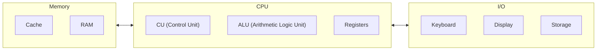

import AiChat from "../../components/AiChat.astro";

## 汇编语言

由于 CPU 只能处理二进制的 0 和 1，人们发明了汇编语言，用于编写 human-readable 指令，而这些指令又能直接对应到机器码供 CPU 执行。例如 `add rax, 1` 显然比他的机器码 `4883C001` （`01001000 10000011 11000000 00000001`）更容易记住。

机器码通常会被写作 `Shellcode`，也就是机器码的 hex 表示。

### High-level vs. Low-level

不同 CPU 架构认识的指令不同，所以以前都是用不同的汇编来给不同的 CPU 写程序，直到 C 语言被发明。

当高级语言被编译时，会生成对应 CPU 的汇编语言，之后再被翻译为机器码。

随后，解释型语言被开发出来，比如 `Python`, `PHP`, `Bash`, `JavaScript` 等等，他们并不会被编译，而是在运行时解释。这种类型的语言会 utilize 预编译好的库来执行他们的指令。这种语言通常使用其他高级语言编写。

### 编译过程

以我们在 python 中写一行 hello world 为例：

```python
print("Hello World!")
```

如果使用 py 执行，那么它会执行类似以下 C 代码：

```c
#include <unistd.h>

int main()
{
    write(1, "Hello World!", 12);
    _exit(0);
}
```

> 当然实际上没这么简单，C 的源代码会更长。

上面的代码中使用了 linux 的 `write` syscall，同样的汇编大概是：

```asm
mov rax, 1
mov rdi, 1
mov rsi, message
mov rdx, 12
syscall

mov rax, 60
mov rdi, 0
syscall
```

可以看到，不管是 C 还是汇编，都使用了 `1` 以及 `12` 作为参数，之后会解释这些内容。

之后汇编会被 assembled 到以下的 hex 形式机器码：

```shellcode
48 c7 c0 01
48 c7 c7 01
48 8b 34 25
48 c7 c2 0c
0f 05

48 c7 c0 3c
48 c7 c7 00
0f 05
```

当 CPU 执行时，这些代码会被翻译为二进制，看起来就像是：

```binary
01001000 11000111 11000000 00000001
01001000 11000111 11000111 00000001
01001000 10001011 00110100 00100101
01001000 11000111 11000010 00001100
00001111 00000101

01001000 11000111 11000000 00111100
01001000 11000111 11000111 00000000
00001111 00000101
```

CPU 用不同的电平代表 `1` 和 `0`，因此可以获取数据并进行计算。

> 一些跨平台语言，比如 `Java`，代码会被编译为 Java 字节码，对所有的 CPU/系统 都一样，然后他们被本地的 JRE 编译为机器码。_这也是导致 Java 比其他例如 C++ 这样直接编译为机器码的语言慢的原因，所以 C++ 这样的语言更适合做性能敏感的程序，例如游戏。_

### 对渗透测试人员的价值

对于那些已经编译好的程序，唯一攻破他们的方式就是通过二进制。反编译、debug 并且理解内存在的指令，最后找到潜在的问题。这都需要你理解汇编、理解他们在 CPU 内部的执行流。

这个 course 主要是学习 x86 汇编，不会涉及到 ARM 汇编，不过理解 x86 对你理解 ARM 也会有帮助。

### 章节练习

在上文的 hello world 示例里，'00001111 00000101' 会执行哪条汇编指令？

显然是个 syscall。

## 计算机体系结构

现代计算机的架构都是“冯·诺依曼结构”，通常包含以下组件：

- 中央处理器（CPU）
- 内存
- 输入/输出设备
  - 大容量存储器
  - 键盘
  - 显示器

此外，CPU 本身由以下的三个部分组成：

- control unit（CU）
- 计算/逻辑单元（ALU）
- 寄存器



虽然很老，但这个架构仍然是现代计算机、服务器、甚至手机的基础。

汇编主要在 CPU、内存中工作，所以这也是为什么我们要理解通用计算机架构。这样我们才能在使用汇编指令移动、处理数据时，知道数据从哪来、到哪去以及指令的开销。

再往后，不管是基础的还是进阶的二进制程序的理解都需要你有对计算机体系结构的基础认识。

### 内存

内存存储当前运行程序的**临时**数据和指令。CPU 从中取指令、数据，内存的速度非常快。主要有两种内存：

1. Cache
2. Random Access Memory (RAM)

#### Cache

cache 一般位于 CPU 内部，跟 RAM 比更快，它以和 CPU 一样的时钟速率运行。

RAM 的时钟频率更低，但成本也更低。缓存通常有 L1，L2，L3 三级缓存。

#### RAM

RAM 的容量比 cache 大，且距离 CPU 核心也更远，所以速度也更慢。

当程序运行时，它所有的数据和指令都会从存储单元移动到 RAM，在需要时被 CPU 访问。这是因为直接访问存储单元更慢，会增加处理数据的时间。当程序关闭时，它的数据也会被从内存中删除，内存空间继续被复用。


如图，RAM 会被主要分为四个 `segments`：

| segment | desc                                                                    |
| ------- | ----------------------------------------------------------------------- |
| stack   | fixed sized，LIFO                                                       |
| heap    | 层级结构，空间更大，可以以任意的顺序存取数据。但这也让 heap 比 stack 慢 |
| data    | 两个部分，`Data` 用于存储变量，`.bss` 用于存储未赋值的变量              |
| text    | 汇编指令被存到这个地方，等 CPU 取指令执行                               |

当然，运行时每个应用都会被分配专属它的虚拟内存。也就是说每个应用程序都有他的 segments。

### IO/存储

键盘、显示器、长期存储单元等等。CPU 可以通过总线来控制 IO 设备

## CPU 架构

CPU 包含 control unit（CU），负责移动、控制数据，以及 arithmetic/logic unit（ALU），负责执行数值、逻辑计算。

CPU 处理数据的方式、效率取决于 instruction set architecture（ISA）。RISC 提供比较简单的指令，需要更多的 CPU 周期，但是每个周期都更短，也更节能。CISC 基于更少、更复杂的指令，可以在更少的周期内完成指令，但每个周期需要的时间更多、能量更多。

简单看一下 RISC 和 CISC，并且了解一下指令周期、寄存器。

### 时钟速率 & 时钟周期

每个 CPU 都有时钟速率，表明它的速度，时钟的每个 tick 都会运行一个时钟周期的指令，例如取地址、存数据（由 CU、ALU 完成）

使用赫兹恒量周期发生的频率。如果 CPU 速度是 3 GHz，它的每个核心就可以每秒执行 3 百亿个后期。

当然，现代 CPU 都是多核设计，每个核心的速率可能不同

### 指令周期

一个 instruction cycle 是指 CPU 需要执行一条机器指令的 cycle。

一个指令周期包含四个步骤：取指令（fetch）、译码（decode）、执行（execute）以及存储（store）：

| 指令   | 描述                                                       |
| ------ | ---------------------------------------------------------- |
| 取指令 | 从 instruction address register (IAR) 中取下一个指令的地址 |
| 译码   | 从 IAR 中取当前指令，解码为二进制                          |
| 执行   | 从寄存器/内存中读操作数，在 ALU 或者 CU 中执行指令         |
| 存储   | 在目标操作数中存储新值（啥？）                             |

> 除计算在 ALU 执行外，所有的阶段都由 CU 执行

每个指令周期可能需要多个时钟周期才能完成，取决于 CPU 的结构、指令复杂度。执行一个指令后，CU 就会立刻执行下一条指令，如此循环。

比如想执行 `add rax, 1`，需要经历以下的指令代码：

1. 从 `rip` 寄存器取指令，`48 83 C0 01`
2. 解码
3. CU 从 `rax` 中取当前的值，`ALU` 向这个值增加 1
4. 向 `rax` 存回计算结果

过去，CPU 只能顺序处理这些指令，现代 CPU 可以同时执行多条指令。

### 处理器

每个处理器支持的指令集不同。比如 `4883C001` 对于 intel 的 x86 处理器来说是 `add rax 1` 对于 ARM 的处理器来说是 `biceq r8, r0, r8, asr #6`。

这是因为每个处理器都有不同的底层汇编语言架构，即 Instruction Set Architectures (ISA)。

**你需要记住每个处理器支持的指令集以及它们对应的机器码是不同的。**

此外，同一个 ISA 可能有不同的语义表达形式，例如之前的 `add` 在如果以 intel 风格汇编表达的话是 `add rax, 1`，如果是 AT&T 风格就是 `addb $0x1, %rax`

> 本系列以 intel 风格为主

## ISA

ISA 指定了不同架构上汇编语言的语法、语义，他们是被 built in CPU 的。

`ISA` 主要包含四个部分：

- 指令
- 寄存器
- 内存地址
- 数据类型

| 组件     | 描述                                                        | 示例                                |
| -------- | ----------------------------------------------------------- | ----------------------------------- |
| 指令     | 格式为 `opcode operand_list`，通常有 1~3 个操作数，逗号隔开 | `add rax, 1`，`mov rsp`，`push rax` |
| 寄存器   | 临时存储操作数、地址或者指令                                | `rax`, `rsp`, `rip`                 |
| 内存地址 | 数据或指令存储的地址，可能是内存也可能是寄存器              | `0x44d0`, `$rax`                    |
| 数据类型 | 数据类型                                                    | `byte`, `word`, `double word`       |

主要有两种常见的 ISA：

1. 复杂指令集 CISC，intel 和 amd 的 CPU 使用
2. 简单指令集 RISC，ARM 和 苹果 的 CPU 使用

### CISC

CISC 架构很早就被开发出来了，主要目的是以复杂的指令降低执行的指令条数。

举个例子，`add rax, rbx`，CISC 处理器可以在一个指令周期内直接完成所有的计算步骤，而不是把他拆分成从 `rax` 取值，再从 `rbx` 取值，然后相加最后存入 `rax`，这样的话每一步都会有单独的指令周期。

不过即使 CISC 可以执行复杂指令，但同时也需要更多的时钟周期，此外还有更高的功耗。

### RISC

RISC 架构尽量把指令拆分为基础的指令，CPU 被设计为只能处理简单指令。

例如 `add r1, r2, r3`，RISC 处理器会先取 `r2` `r3`，相加，然后把他们存入 `r1`，每一步都要经历四个阶段，显然程序的总指令数量更多。

相较之下，RISC 支持大概 200 种不同指令，CISC 支持大概 1500 种指令，所以如果要执行复杂的指令，需要把低级指令组合起来。

| 领域               | CISC                 | RISC                 |
| ------------------ | -------------------- | -------------------- |
| 复杂度             | 复杂                 | 简单                 |
| 指令长度           | 长度更长             | 固定的 32/64 bit     |
| 单个程序的总指令数 | 更少                 | 更多                 |
| 优化               | 依赖硬件优化（CPU）  | 依赖软件优化（汇编） |
| 执行时间           | 可变（多个时钟周期） | 固定（一个时钟周期） |
| CPU 支持的指令数   | ~1500                | ~200                 |
| 功耗               | 高                   | 很低                 |
| 示例               | intel，AMD           | ARM，苹果            |

现代计算机中存储空间更大，此外，汇编器、编译器的优化也更好，以及天生的低功耗，所以 RISC 越来越常见。

不过大量的计算机仍然跑在 intel、AMD 处理器上，所以学习 CISC 仍然是首要目标。汇编的基础都是通用的，学会 CISC 后学习 ARM 更简单。

## 寄存器、地址以及数据类型

理解了计算机的基础架构之后，我们需要理解：寄存器、内存地址、地址大小端、数据类型。可以防止我们写代码时掉坑里。

### 寄存器

每个 CPU 核心都有一系列的寄存器，寄存器是计算机最快的组件，是 built in CPU 的。不过他们的大小优先，只能持有几个字节的数据。x86 有很多寄存器，但我们只会关注其中一部分。

主要有两个类型的寄存器是我们要关注的：数据寄存器、指针寄存器

| 数据寄存器 | 指针寄存器 |
| ---------- | ---------- |
| `rax`      | `rbp`      |
| `rbx`      | `rsp`      |
| `rcx`      | `rip`      |
| `rdx`      |            |
| `r8`       |            |
| `r9`       |            |
| `r10`      |            |

- 数据寄存器：通常用来存储指令/syscall 的参数，主要的数据寄存器是 `rax`, `rbx`, `rcx` 和 `rdx`。`rdi` 和 `rsi` 也存在，通常用于操作数的 `dest` 和 `src`。当主要寄存器都被使用后，还有一些次要的寄存器，比如 `r8`, `r9`, `r10`
- 指针寄存器：用于存储重要的地址指针。主要的地址寄存器是 `rbp`，存储 base stack ptr，指向 stack 的 beginning，`rsp` current stack ptr，指向 top of the stack，以及指令寄存器 `rip`，存储下一个指令的地址。

<AiChat
  question="现代的 x86 CPU 除了 rax, rbx, rcx, rdx, r8, r9, r10, rsp, rip, rbp 之外还有哪些寄存器？通常一般的作用是什么？上面列举的寄存器是比较重要的吗？"
  answer="x86-64 的寄存器比你列的要多不少。你列出的确实是最常用的一批，但还缺了一些重要的。

你遗漏的通用寄存器
寄存器 典型用途
rsi 源索引（string ops 的源地址）
rdi 目标索引（string ops 的目标地址）
r11 通用；syscall 指令用其保存原始 rflags
r12–r15 纯通用寄存器（x86-64 新增）
其中 rsi/rdi 在调用约定中非常重要——System V AMD64 ABI 用 rdi, rsi, rdx, rcx, r8, r9 依次传递函数前 6 个整数参数。

标志寄存器
rflags — 存储 CPU 状态标志（零标志 ZF、进位 CF、符号 SF、溢出 OF 等），条件跳转都依赖它。
段寄存器
cs, ds, es, fs, gs, ss — 64 位模式下大部分已弱化，但 fs/gs 常用于线程本地存储（TLS），Linux 用 fs 存 thread_info 指针。
SIMD / 浮点寄存器
寄存器 宽度 用途
xmm0–xmm15 (或 31) 128 bit SSE 浮点/整数向量运算
ymm0–ymm15 (或 31) 256 bit AVX 向量运算
zmm0–zmm31 512 bit AVX-512 向量运算
mmx0–mm7 64 bit MMX（已过时）
st0–st7 80 bit x87 FPU（已过时）
mxcsr — SSE 控制/状态寄存器
浮点/SIMD 在 CTF 逆向中遇到较少，但做性能优化或密码学算法时会碰到。

控制 / 系统寄存器
寄存器 用途
cr0–cr4 控制寄存器（分页开关、保护模式等）
dr0–dr7 调试寄存器（硬件断点）
gdtr / idtr / ldtr / tr 描述符表寄存器
MSR 型号特定寄存器（rdmsr/wrmsr 访问）
做 kernel exploit 或 OS 开发时才需要关心这些。

你列的那些重要吗？
非常重要，它们覆盖了绝大多数用户态和 CTF 场景中最常遇到的寄存器。简单分类：

rax–rdx, rsi, rdi — 核心通用寄存器，函数返回值(rax)、参数传递(rdi/rsi/rdx/rcx/r8/r9)
rsp / rbp — 栈管理，pwn 题必看
rip — 指令指针，控制流劫持的目标
r8–r15 — x86-64 扩展通用寄存器，编译器自由使用
如果你在做 HTB 的 ASM 系列，主要关注 通用寄存器 + rflags + rsp/rip 就够了，其余按需查阅。"
/>

### Sub-Registers

每个 64 位寄存器可以被分成更小的寄存器，比如 8 位、16 位 或者 32 位寄存器。

| bit 位 | 字节   | 名称                | 示例  |
| ------ | ------ | ------------------- | ----- |
| 16 位  | 2 字节 | 基础名称            | `ax`  |
| 8 位   | 1 字节 | 以 `l` 结尾基础名称 | `al`  |
| 32 位  | 4 字节 | 基础名称 + `e` 前缀 | `eax` |
| 64 位  | 8 字节 | 基础名称 + `r` 前缀 | `rax` |

以下是一些重要寄存器的对照表：

| 描述                    | 64 位 | 32 位 | 16位  | 8位   |
| ----------------------- | ----- | ----- | ----- | ----- |
| 数据寄存器              |       |       |       |       |
| syscall 号/返回值       | `rax` | `eax` | `ax`  | `al`  |
| callee saved            | `rbx` | `ebx` | `bx`  | `bl`  |
| 第一个参数 - 目标操作数 | `rdi` | `edi` | `di`  | `dil` |
| 第二个参数 - 原操作数   | `rsi` | `esi` | `si`  | `sil` |
| 第三个参数              | `rdx` | `edx` | `dx`  | `dl`  |
| 第四个参数 - 循环计数器 | `rcx` | `ecx` | `cx`  | `cl`  |
| 第五个参数              | `r8`  | `r8d` | `r8w` | `r8b` |
| 第六个参数              | `r9`  | `r9d` | `r9w` | `r9b` |
| 指针寄存器              |       |       |       |       |
| base stack ptr          | `rbp` | `ebp` | `bp`  | `bpl` |
| current/top stack ptr   | `rsp` | `esp` | `sp`  | `spl` |
| instruction ptr         | `rip` | `eip` | `ip`  | `ipl` |

其他还有很多寄存器，但我们暂时忽略。

### 内存地址

x86 64 位处理器的内存地址范围是 `0x0` ~ `0xfffffffffffffff`，但内存实际上会被分为很多区域，stack、heap、其他程序的区域、内核特定的区域，每个区域都有不同的读写、执行权限。

执行指令的第一步永远是取其地址，x86 有不同的取址类型：

| 类型      | 描述                             | 示例                            |
| --------- | -------------------------------- | ------------------------------- |
| immediate | 在指令中就给出了值               | `add 2`                         |
| 寄存器    | 指令中给出的是持有变量的寄存器名 | `add rax`                       |
| direct    | 指令中给出了指令的地址           | `call 0xffffffffaa8a25ff`       |
| indirect  | 指令中给出的是一个指针           | `call 0x44d000` or `call [rax]` |
| stack     | 地址是 top of the stack          | `add rsp`                       |

### 地址 endianness

endianness 是字节存储和从内存取出时的顺序，主要是大端序和小端序，对于小端序的处理器，存储时按从右到左填写字节。

比如，如果地址 `0x0011223344556677` 要存储到内存，小端序会先在最右边存 `0x00`，然后向左是 `0x11`，最后存储在内存中变成：`0x7766554433221100`，当然取出的时候也要按原顺序取出，所以实际上值是不变的。

> Roses: 大端序也类似，但实际上应该没人用大端序吧，除了网络传输。上次 linus 因为有人往内核提交 RISC-V 大端序的代码喷了别人一顿。

这个 project 也会使用小端序，因为 intel AMD x86 CPU 和大部分系统都是小端序。

**总之重要的是我们要记住，存储字节时是从右到左的。**

### 数据类型

x86 支持很多数据类型，以下是指令中会使用到的数据类型：

| component             | 长度              | 示例                 |
| --------------------- | ----------------- | -------------------- |
| `byte`                | 8 bits            | `0xab`               |
| `word`                | 16 bits - 2 bytes | `0xabcd`             |
| `dword` (double word) | 32 bits - 4 bytes | `0xabcdef12`         |
| `qword` (qword)       | 64 bits - 8 bytes | `0xabcdef1234567890` |

当我们使用一个具体数据类型的变量或者在指令中使用数据类型时，两个操作数都应该有相同的 size。

比如，我们并不能在 `rax` 中使用 byte 类型变量，因为 `rax` 长度是 8 字节，我们应该使用 `al`。
