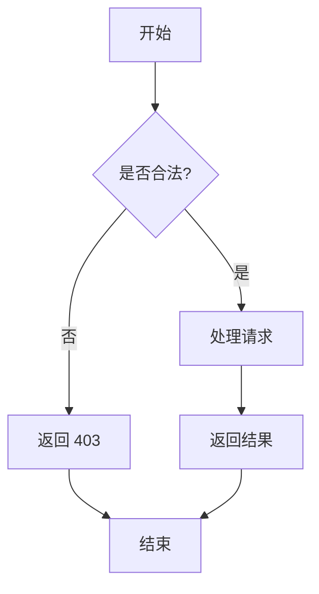
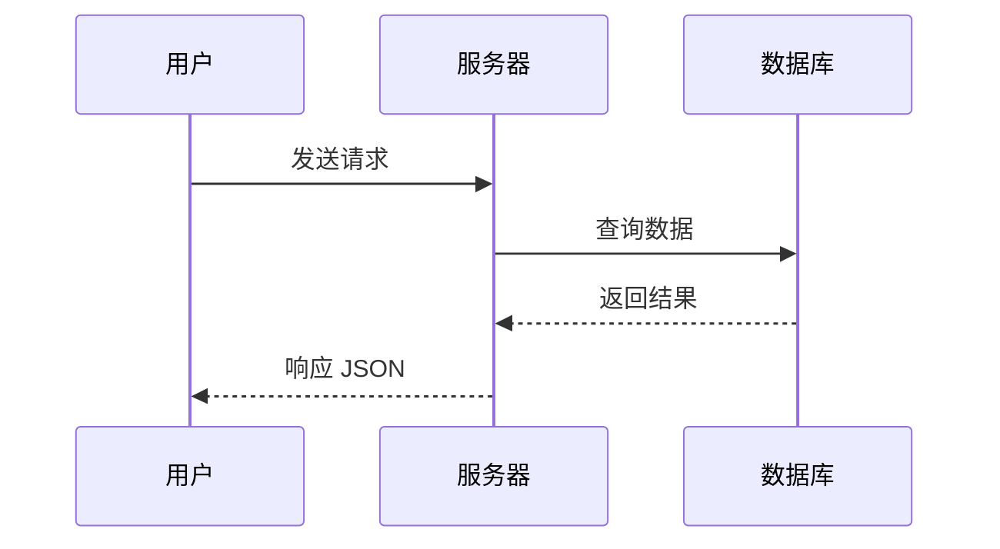

import WasmRunner from "../../components/WasmRunner.astro";
import AiChat from "../../components/AiChat.astro";
import MafsCoordinate from "../../components/MafsCoordinate.astro";

## 标题层级

这是一段普通文本。Markdown 支持从 `h1` 到 `h6` 的标题层级，本篇从 `h2` 开始。

### 三级标题

#### 四级标题

---

## 文本格式

**加粗文本**，_斜体文本_，**_加粗斜体_**，~~删除线~~，`行内代码`。

还有 [超链接](https://astro.build) 可以指向任意 URL。

---

## 列表

### 无序列表

- 第一项
- 第二项
  - 嵌套子项 A
  - 嵌套子项 B
- 第三项

### 有序列表

1. 首先
2. 然后
3. 最后

### 任务列表

- [x] 已完成
- [x] 已完成
- [ ] 未完成

---

## 引用

> 好的设计是尽可能少的设计。
> — Dieter Rams

> 嵌套引用：
>
> > 内层引用内容

---

## 代码

### 行内代码

使用 `const x = 42;` 来定义常量。

### 代码块 — TypeScript

```typescript
interface Post {
  title: string;
  date: Date;
  tags: string[];
}

function formatPost(post: Post): string {
  return `# ${post.title}\n_${post.date}_`;
}
```

### 代码块 — Rust

```rust
fn fibonacci(n: u32) -> u64 {
    match n {
        0 => 0,
        1 => 1,
        _ => fibonacci(n - 1) + fibonacci(n - 2),
    }
}

fn main() {
    for i in 0..10 {
        println!("fib({}) = {}", i, fibonacci(i));
    }
}
```

### 代码块 — Shell

```bash
curl -s https://api.example.com/data | jq '.results[].name'
```

---

## 表格

| 功能 | 语法          | 示例                        |
| ---- | ------------- | --------------------------- |
| 加粗 | `**text**`    | **bold**                    |
| 斜体 | `*text*`      | _italic_                    |
| 代码 | `` `code` ``  | `code`                      |
| 链接 | `[text](url)` | [link](https://example.com) |
| 图片 | `` | 见下方                      |

---

## 图片


---

## 数学公式 (LaTeX / KaTeX)

### 行内公式

质能方程 $E = mc^2$，欧拉恒等式 $e^{i\pi} + 1 = 0$，求和 $\sum_{k=1}^{n} k = \frac{n(n+1)}{2}$。

### 块级公式

高斯积分：

$$
\int_{-\infty}^{\infty} e^{-x^2} \, dx = \sqrt{\pi}
$$

麦克斯韦方程组（微分形式）：

$$
\begin{aligned}
\nabla \cdot \mathbf{E} &= \frac{\rho}{\varepsilon_0} \\
\nabla \cdot \mathbf{B} &= 0 \\
\nabla \times \mathbf{E} &= -\frac{\partial \mathbf{B}}{\partial t} \\
\nabla \times \mathbf{B} &= \mu_0 \mathbf{J} + \mu_0 \varepsilon_0 \frac{\partial \mathbf{E}}{\partial t}
\end{aligned}
$$

矩阵：

$$
A = \begin{pmatrix}
a_{11} & a_{12} & \cdots & a_{1n} \\
a_{21} & a_{22} & \cdots & a_{2n} \\
\vdots & \vdots & \ddots & \vdots \\
a_{m1} & a_{m2} & \cdots & a_{mn}
\end{pmatrix}
$$

薛定谔方程：

$$
i\hbar \frac{\partial}{\partial t} \Psi(\mathbf{r}, t) = \hat{H} \Psi(\mathbf{r}, t)
$$

贝叶斯定理：

$$
P(A \mid B) = \frac{P(B \mid A) \, P(A)}{P(B)}
$$

---

## 分隔线

上面是一条分隔线。

---

## HTML 嵌入

<div style='padding: 1rem; background: #f0fdf4; border-left: 3px solid #22c55e; border-radius: 4px; margin: 1rem 0;'>
  <strong>提示：</strong>Markdown 中可以直接使用 HTML 标签。
</div>

---

## WASM 嵌入

<WasmRunner wasmUrl='/wasm/example.wasm' />

> 上方为 WASM 加载区域。将编译好的 `.wasm` 文件放入 `public/wasm/` 目录即可自动加载和执行。`WasmRunner` 组件支持导出 `_start`、`main` 以及 `update`+`render`（动画循环）等常见入口。

---

## Mafs 数学可视化

使用 [Mafs](https://mafs.dev) 库绘制交互式坐标系和向量，适合线性代数笔记。

### 基本坐标系

<MafsCoordinate xMin={-4} xMax={4} yMin={-4} yMax={4} />

> 鼠标拖拽平移，滚轮缩放。坐标系范围：$x \in [-4, 4]$，$y \in [-4, 4]$。

### 向量

<MafsCoordinate
  xMin={-5} xMax={5} yMin={-3} yMax={5}
  vectors={[
    { tip: [3, 2], label: "v" }
  ]}
/>

向量 $\vec{v} = \langle 3, 2 \rangle$，模长 $\|\vec{v}\| = \sqrt{13}$。

### 点的标记

<MafsCoordinate
  xMin={-3} xMax={3} yMin={-3} yMax={3}
  points={[
    { x: 1, y: 2, label: "A" },
    { x: -2, y: -1, label: "B" }
  ]}
/>

---

## AI 对话嵌入

<AiChat
  question="什么是 Astro 框架？它有什么优势？"
  answer="Astro 是一个现代化的静态站点生成器，专为构建内容驱动的网站而设计。它的核心优势包括：

1. 零 JS 默认 —— Astro 默认输出纯静态 HTML，不会向浏览器发送任何 JavaScript 框架代码，页面加载速度极快。

2. 岛屿架构 —— 通过 Astro 组件系统，你可以使用 React、Preact、Vue、Svelte 等任意框架编写交互组件，它们仅在需要时才加载 JS。

3. 内容集合 —— 内置类型安全的内容管理，支持 Markdown、MDX 等格式，配合 Zod schema 进行字段校验。

4. 统一的开发体验 —— 不论你的组件用什么框架，都能在同一个项目中无缝协作。

Astro 非常适合博客、文档站点、营销页面等以内容为核心的项目。如果你追求极致的性能和简洁的架构，Astro 是一个值得考虑的选择。"
/>

> 上方为 AI 对话嵌入区域。点击可展开并观看打字机效果，再次点击可立即显示全部内容，再点一次收起。

---

## Mermaid 图表

### 流程图



### 时序图



---

## 提示块 (GitHub Alerts)

> [!NOTE]
> 这是一条备注信息，用于提供有用的上下文。

> [!TIP]
> 这是一条提示，帮助你更好地完成任务。

> [!IMPORTANT]
> 这是重要信息，用户必须关注。

> [!WARNING]
> 这是警告，需要立即注意以避免问题。

> [!CAUTION]
> 这是危险提示，提醒某些操作可能带来的负面后果。

---

## 脚注

这是一段包含脚注的文本[^1]，还有另一个脚注[^2]。

[^1]: 这是第一个脚注的内容。
[^2]: 这是第二个脚注的内容，支持 **Markdown** 格式。

---

_本文展示了 Markdown 在博客中的大部分常见用法。_
